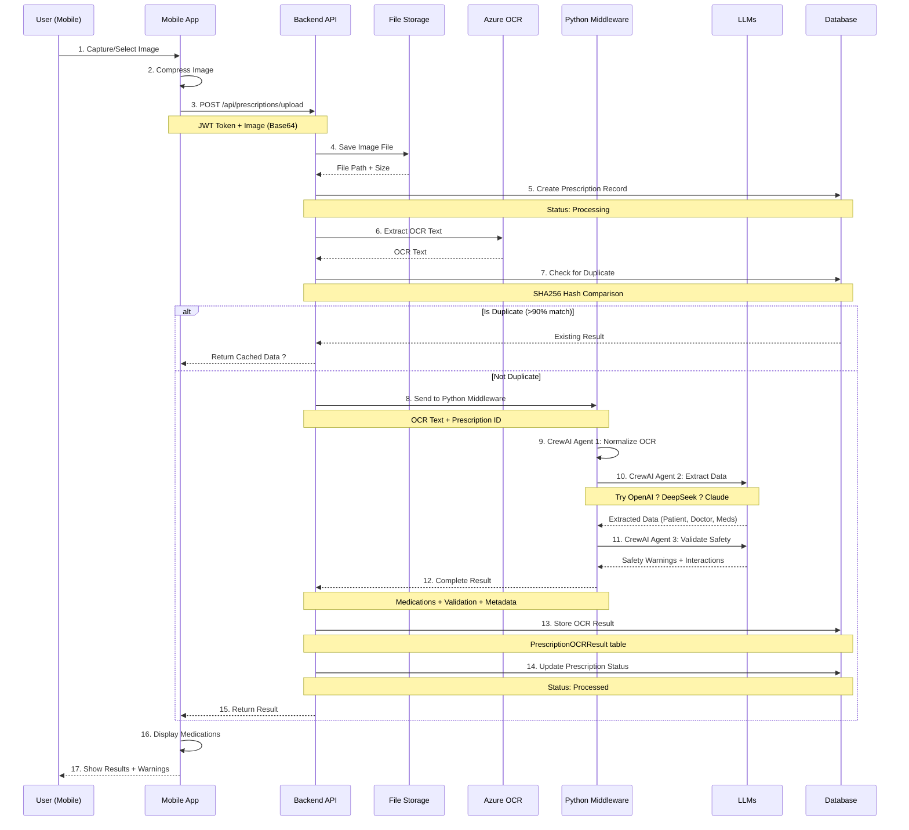
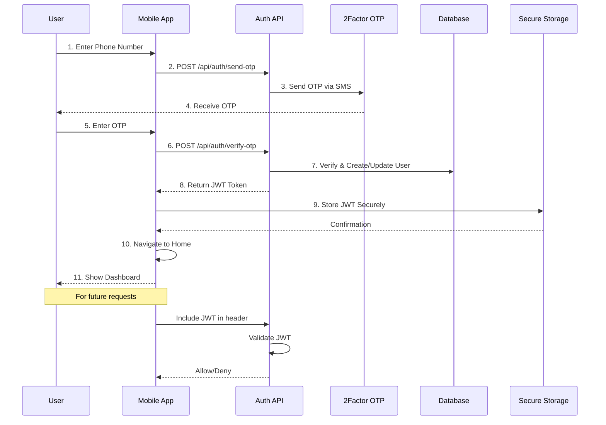

# ?? MedRemind Data Flow Diagrams

Comprehensive data flow diagrams showing how data moves through the system.

---

## ?? Prescription Upload & Processing Flow

### Complete End-to-End Flow



---

## ?? Detailed Processing Steps

### Step-by-Step Breakdown

```
???????????????????????????????????????????????????????????????
?  STEP 1: IMAGE CAPTURE & PREPARATION                        ?
???????????????????????????????????????????????????????????????

Mobile App:
??? User captures or selects image
??? Validate file type (JPG, PNG, PDF)
??? Check file size (<20MB)
??? Compress image if needed
?   ??? Quality: 85%
?   ??? Max dimension: 2048px
??? Convert to Base64

Time: ~1-2s
Status: ? Complete

???????????????????????????????????????????????????????????????
?  STEP 2: FILE UPLOAD & STORAGE                              ?
???????????????????????????????????????????????????????????????

Backend API:
??? Receive Base64 image
??? Validate JWT token
??? Validate user authorization
??? Generate unique filename
?   ??? Format: user_{userId}_{timestamp}.{ext}
??? Save to storage
?   ??? Path: Files/{userId}/
??? Calculate file size

Time: ~0.5-1s
Status: ? Complete

???????????????????????????????????????????????????????????????
?  STEP 3: DATABASE RECORD CREATION                           ?
???????????????????????????????????????????????????????????????

Prescription Table:
??? Id: Auto-generated
??? UserId: From JWT
??? ImagePath: Relative path
??? FileName: Original/Unique filename ?
??? FileSize: In bytes ?
??? Status: "Processing"
??? CreatedAt: Current timestamp
??? DoctorName: NULL (to be filled)

Time: ~0.1s
Status: ? Complete

???????????????????????????????????????????????????????????????
?  STEP 4: OCR TEXT EXTRACTION                                ?
???????????????????????????????????????????????????????????????

Azure Document Intelligence:
??? Send image to Azure API
??? Extract text with layout
??? Preprocess OCR text
?   ??? Remove excessive whitespace
?   ??? Normalize line breaks
?   ??? Basic cleanup
??? Save OCR text to file
    ??? Path: OCRs/ocr_{prescriptionId}.txt

Time: ~2-4s
Status: ? Complete

???????????????????????????????????????????????????????????????
?  STEP 5: DUPLICATE DETECTION                                ?
???????????????????????????????????????????????????????????????

Deduplication Service:
??? Calculate OCR text hash (SHA256)
??? Query PrescriptionOCRResults table
??? Compare OCR text similarity
?   ??? Algorithm: Levenshtein distance
?   ??? Threshold: 90% match
??? If duplicate found:
?   ??? Load existing result
?   ??? Update prescription reference
?   ??? Return cached data (? Save costs!)
??? If not duplicate: Continue processing

Time: ~0.2s
Status: ? Complete

???????????????????????????????????????????????????????????????
?  STEP 6: PYTHON MIDDLEWARE PROCESSING                       ?
???????????????????????????????????????????????????????????????

FastAPI Service:
??? Receive request: POST /api/prescription/parse
??? Input:
?   ??? ocr_text: str
?   ??? prescription_id: str
?   ??? save_result: bool = True
??? Invoke CrewAI orchestration

Time: ~0.1s (orchestration init)
Status: ? Complete

???????????????????????????????????????????????????????????????
?  STEP 7: CREWAI AGENT 1 - OCR NORMALIZATION                ?
???????????????????????????????????????????????????????????????

OCR Normalizer Agent:
??? Input: Raw OCR text
??? Tasks:
?   ??? Remove artifacts
?   ??? Fix common OCR errors
?   ??? Standardize date formats
?   ??? Normalize medication names
?   ??? Clean special characters
??? Output: Normalized text

Time: ~1s
Status: ? Complete

???????????????????????????????????????????????????????????????
?  STEP 8: CREWAI AGENT 2 - DATA EXTRACTION (Multi-LLM)      ?
???????????????????????????????????????????????????????????????

Data Extractor Agent:
??? Input: Normalized OCR text
??? LLM Strategy: Try in order
?   ?
?   ??? 1st Try: OpenAI GPT-4o-mini
?   ?   ??? Model: gpt-4o-mini
?   ?   ??? Temperature: 0.1
?   ?   ??? Max tokens: 4000
?   ?   ??? If success: Use result
?   ?
?   ??? 2nd Try: DeepSeek Chat (if OpenAI fails)
?   ?   ??? Model: deepseek-chat
?   ?   ??? Temperature: 0.1
?   ?   ??? Max tokens: 4000
?   ?   ??? If success: Use result
?   ?
?   ??? 3rd Try: Claude 3.5 Sonnet (if both fail)
?       ??? Model: claude-3-5-sonnet-latest
?       ??? Temperature: 0.1
?       ??? Max tokens: 4000
?       ??? Final fallback
?
??? Extract:
?   ??? Patient Info:
?   ?   ??? Name
?   ?   ??? Age
?   ?   ??? Gender
?   ?
?   ??? Doctor Info:
?   ?   ??? Name
?   ?   ??? Registration Number
?   ?   ??? Specialization
?   ?
?   ??? Prescription Date
?   ?
?   ??? Medications (for each):
?       ??? Name
?       ??? Dosage + Unit
?       ??? Frequency + Count
?       ??? Duration + Days
?       ??? Timing
?       ??? Instructions
?       ??? Purpose/Indication ?
?       ??? Side Effects ?
?       ??? Confidence Score
?
??? Output: Structured JSON

Time: ~5-8s (depends on LLM)
Status: ? Complete

???????????????????????????????????????????????????????????????
?  STEP 9: CREWAI AGENT 3 - SAFETY VALIDATION                ?
???????????????????????????????????????????????????????????????

Safety Validator Agent:
??? Input: Extracted medications + patient info
??? Validation Checks:
?   ?
?   ??? Drug-Drug Interactions:
?   ?   ??? Check each medication pair
?   ?   ??? Severity: low, moderate, high, major
?   ?   ??? Description of interaction
?   ?   ??? Recommendation
?   ?
?   ??? Age-Based Safety:
?   ?   ??? Check if medication appropriate for age
?   ?   ??? Pediatric concerns (<18)
?   ?   ??? Geriatric concerns (>65)
?   ?   ??? Generate warnings
?   ?
?   ??? Dosage Validation:
?   ?   ??? Check if dosage in normal range
?   ?   ??? Flag unusual dosages
?   ?   ??? Provide recommendations
?   ?
?   ??? Duplicate Therapies:
?   ?   ??? Check for same drug class
?   ?   ??? Flag potential duplicates
?   ?
?   ??? Overall Safety Score:
?       ??? Calculate: 0.0 - 1.0
?       ??? <0.7: High risk
?       ??? 0.7-0.85: Moderate risk
?       ??? >0.85: Low risk
?
??? Generate:
?   ??? Safety warnings list
?   ??? Drug interactions list
?   ??? Overall safety score
?   ??? Pharmacist review flag
?
??? Output: MedicineValidation JSON

Time: ~2-3s
Status: ? Complete

???????????????????????????????????????????????????????????????
?  STEP 10: RESULT STORAGE                                    ?
???????????????????????????????????????????????????????????????

Backend API - Save to Database:

1. PrescriptionOCRResult Table:
   ??? OCRText: Full text
   ??? OCRTextHash: SHA256 hash
   ??? OpenAIResponse: Full result JSON ?
   ??? DeepSeekResponse: Alternative JSON ?
   ??? ClaudeResponse: Validation JSON ?
   ??? SelectedResponse: Best result
   ??? SelectedProvider: "Python Middleware (CrewAI)"
   ??? LlmModelsUsed: "gpt-4o-mini,deepseek-chat,claude-3.5" ?
   ??? CrewAISummary: Processing summary ?
   ??? OverallSafetyScore: 0.0-1.0 ?
   ??? RequiresPharmacistReview: true/false ?
   ??? SafetyWarningsCount: Integer ?
   ??? DrugInteractionsCount: Integer ?
   ??? MedicationCount: Integer
   ??? DoctorName: Extracted name
   ??? PatientName: Extracted name
   ??? ProcessedAt: Timestamp
   ??? ProcessingTime: TimeSpan

2. Prescription Table (Update):
   ??? DoctorName: Update
   ??? PrescriptionDate: Update
   ??? Status: "Processed"
   ??? ProcessedAt: Timestamp

3. Medication Table (Create records):
   For each medication:
   ??? UserId: Current user
   ??? PrescriptionId: Link
   ??? Name: Medicine name
   ??? Dosage + Unit: "500 mg"
   ??? Frequency + Count: "Three times daily" + 3
   ??? Duration + Days: "2 weeks" + 14
   ??? Instructions: Special notes
   ??? MedicineDetails: Purpose/indication ?
   ??? SideEffects: Common side effects ?
   ??? StartDate: Prescription date
   ??? EndDate: StartDate + Duration
   ??? IsActive: true
   ??? CreatedAt: Current timestamp

Time: ~0.5s
Status: ? Complete

???????????????????????????????????????????????????????????????
?  STEP 11: RESPONSE TO CLIENT                                ?
???????????????????????????????????????????????????????????????

API Response JSON:
{
  "success": true,
  "prescriptionId": 123,
  "filePath": "Files/1/user_1_20260202.jpg",
  "fileName": "prescription_image.jpg", ?
  "fileSize": 245760, ?
  "wasCompressed": true,
  
  "medications": [
    {
      "name": "Aspirin",
      "dosage": "500",
      "unit": "mg",
      "frequency": "Three times daily",
      "frequencyCount": 3,
      "duration": "2 weeks",
      "durationDays": 14,
      "instructions": "Take after meals",
      "medicineDetails": "Pain relief, anti-inflammatory", ?
      "sideEffects": "Stomach upset, bleeding risk", ?
      "confidenceScore": 0.95
    }
  ],
  
  "doctorName": "Dr. John Smith",
  "prescriptionDate": "2026-02-01",
  
  "processing": {
    "provider": "Python Middleware (CrewAI)",
    "llmsUsed": "gpt-4o-mini,deepseek-chat,claude-3.5",
    "processingTime": 8.5,
    "safetyScore": 0.85
  },
  
  "validation": {
    "overallSafetyScore": 0.85,
    "requiresPharmacistReview": false,
    "safetyWarnings": [
      {
        "medicine": "Aspirin",
        "type": "dosage",
        "severity": "medium",
        "message": "Dosage at upper limit",
        "recommendation": "Monitor for side effects"
      }
    ],
    "drugInteractions": [],
    "duplicateTherapies": []
  }
}

Time: ~0.1s
Status: ? Complete
```

---

## ?? Total Processing Time Breakdown

```
Step                        Time        % of Total
?????????????????????????????????????????????????????
1. Image Preparation        1-2s        10-15%
2. File Upload              0.5-1s      5-10%
3. DB Record Creation       0.1s        1%
4. OCR Extraction           2-4s        20-30%
5. Duplicate Check          0.2s        2%
6. Python Init              0.1s        1%
7. OCR Normalization        1s          10%
8. Data Extraction (LLM)    5-8s        40-50%
9. Safety Validation        2-3s        15-20%
10. Result Storage          0.5s        5%
11. Response Send           0.1s        1%
?????????????????????????????????????????????????????
TOTAL                       12-22s      100%
AVERAGE                     ~15s
```

---

## ?? Alternative Flows

### Flow 1: Duplicate Prescription Detected

```
User uploads ? File saved ? OCR extracted ? 
Duplicate found (>90% match) ? 
Return existing result immediately ?
(Saves ~10s + LLM API costs!)
```

### Flow 2: LLM Fallback Scenario

```
OCR text ? Python Middleware ?
OpenAI fails ? Try DeepSeek ?
DeepSeek fails ? Try Claude ?
Claude succeeds ? Continue processing
```

### Flow 3: Processing Failure

```
User uploads ? File saved ? OCR fails ?
Update status to "Failed" ?
Return error message ?
User can retry
```

---

## ?? Data Storage Flow

```
????????????????????????????????????????????????????
?         DATA PERSISTENCE FLOW                     ?
????????????????????????????????????????????????????

1. Image File:
   ??? Location: Files/{userId}/
   ??? Filename: user_{userId}_{timestamp}.{ext}
   ??? Compressed: Yes (if >2MB)
   ??? Backed up: No (? Future enhancement)

2. OCR Text:
   ??? Location: OCRs/
   ??? Filename: ocr_{prescriptionId}.txt
   ??? Also stored in: PrescriptionOCRResult.OCRText
   ??? Hash: SHA256 for deduplication

3. LLM Responses:
   ??? PrescriptionOCRResult.OpenAIResponse
   ??? PrescriptionOCRResult.DeepSeekResponse ?
   ??? PrescriptionOCRResult.ClaudeResponse ?
   ??? Format: JSON string
   ??? Purpose: Audit trail + analysis

4. Medications:
   ??? Medication table (one row per medicine)
   ??? Includes: Details + Side effects ?
   ??? Linked to: User + Prescription

5. Processing Metadata:
   ??? LlmModelsUsed: Which LLMs were used ?
   ??? ProcessingTime: How long it took
   ??? SafetyMetrics: Warnings + interactions ?
   ??? CrewAISummary: Agent processing notes ?
```

---

## ?? Authentication Flow



---

## ?? Mobile to Backend Communication Flow

```
Mobile App                  Backend API
    ?                           ?
    ??? 1. Request             ?
    ?   ?? Method: POST        ?
    ?   ?? Header: JWT token   ?
    ?   ?? Body: JSON/Base64   ?
    ?   ?? Timeout: 15 min     ?
    ?                           ?
    ?                           ??? 2. Validate JWT
    ?                           ??? 3. Check authorization
    ?                           ??? 4. Process request
    ?                           ?   ?? Call services
    ?                           ?   ?? Access database
    ?                           ?   ?? External APIs
    ?                           ?
    ?   ???? 5. Response        ?
    ?   ?? Status: 200/400/500  ?
    ?   ?? Body: JSON           ?
    ?   ?? Headers: metadata    ?
    ?                           ?
    ??? 6. Handle response      ?
    ??? 7. Update UI            ?
```

---

## ?? Key Flow Characteristics

### Performance Optimizations
1. ? **Image Compression** - Reduce upload time
2. ? **Duplicate Detection** - Skip processing if duplicate
3. ? **Parallel Processing** - LLM calls can be parallel
4. ? **Caching** - Cache OCR results
5. ?? **CDN Integration** - Serve static files (Future)

### Error Handling
1. ? **Graceful Degradation** - Try multiple LLMs
2. ? **Retry Logic** - Retry on transient failures
3. ? **Clear Error Messages** - User-friendly errors
4. ? **Logging** - Comprehensive debug logs
5. ? **Status Updates** - Prescription status tracking

### Data Integrity
1. ? **Transactions** - Unit of Work pattern
2. ? **Validation** - Input/output validation
3. ? **Constraints** - Database foreign keys
4. ? **Hash Verification** - OCR text hashing
5. ? **Audit Trail** - All LLM responses stored

---

**Last Updated**: 2026-02-02  
**Flow Version**: 2.0  
**Status**: ? Complete & Optimized
