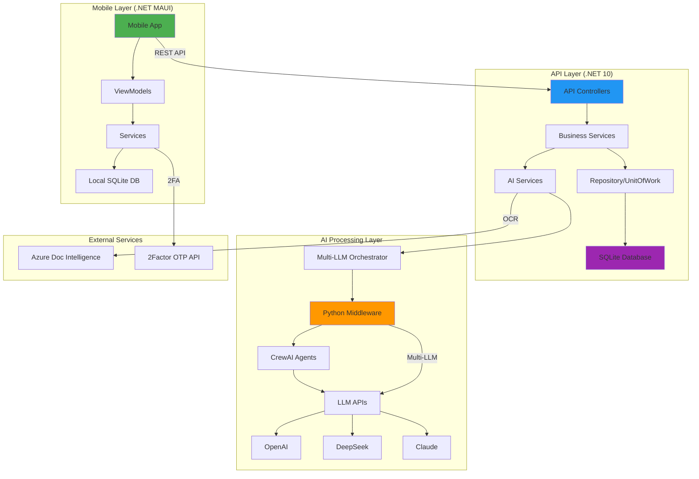

# ??? MedRemind System Architecture Overview

Complete system architecture showing all components, their relationships, and current implementation status.

---

## ?? High-Level Architecture



---

## ?? System Components Status

### ? COMPLETED Components

#### 1. Mobile Application (.NET MAUI)
- ? Authentication (Login/Register with 2FA)
- ? Prescription Upload & Camera Integration
- ? Medication Management
- ? Reminder Scheduling
- ? Adherence Tracking
- ? Settings & Configuration
- ? Local SQLite Database
- ? Biometric Authentication
- ? Secure Storage Integration

#### 2. Backend API (.NET 10)
- ? RESTful API with JWT Authentication
- ? CRUD Operations (Users, Medications, Prescriptions, Reminders)
- ? File Storage Service
- ? OCR Integration (Azure Document Intelligence)
- ? Multi-LLM Orchestration
- ? Prescription Deduplication
- ? SQLite Database with EF Core
- ? Comprehensive Error Handling
- ? Swagger Documentation

#### 3. AI Processing (Python Middleware)
- ? FastAPI Service
- ? CrewAI Multi-Agent System
- ? OCR Normalization Agent
- ? Data Extraction Agent (Multi-LLM)
- ? Safety Validation Agent
- ? Medicine Validation (Drug Interactions)
- ? Safety Warnings Generation
- ? Duplicate Therapy Detection

#### 4. LLM Integration
- ? OpenAI GPT-4o-mini
- ? DeepSeek Chat
- ? Claude 3.5 Sonnet
- ? Intelligent Provider Selection
- ? Fallback Mechanisms
- ? Result Merging & Validation

### ?? IN PROGRESS Components

- ?? Cloud Deployment (Azure/AWS)
- ?? Real-time Notifications (Push Notifications)
- ?? Advanced Analytics Dashboard

### ? MISSING/FUTURE Components

- ? Web Dashboard (Admin Portal)
- ? Pharmacy Integration
- ? Doctor Portal
- ? Telemedicine Integration
- ? Health Records Integration
- ? Multi-language Support
- ? Offline Mode Enhancement

---

## ?? Data Flow Architecture

### Prescription Processing Pipeline

```
??????????????????????????????????????????????????????????????????
?                    PRESCRIPTION PROCESSING                      ?
??????????????????????????????????????????????????????????????????

1. USER INPUT
   ?
   ??? Mobile App: User captures prescription photo
   ?
   ?

2. IMAGE UPLOAD
   ?
   ??? Backend API: Receives image (max 20MB)
   ??? File Storage: Saves compressed image
   ?
   ?

3. OCR EXTRACTION ?
   ?
   ??? Azure Document Intelligence
   ??? Extract text from image
   ??? Save OCR text
   ?
   ?

4. DUPLICATE CHECK ?
   ?
   ??? Calculate OCR text hash (SHA256)
   ??? Check against existing prescriptions
   ??? Return existing data if duplicate (90%+ match)
   ?
   ?

5. AI PROCESSING (Python Middleware) ?
   ?
   ??? CrewAI Multi-Agent System
   ?   ?
   ?   ??? Agent 1: OCR Normalizer
   ?   ?   ??? Clean & standardize text
   ?   ?
   ?   ??? Agent 2: Data Extractor
   ?   ?   ??? Try OpenAI GPT-4o-mini
   ?   ?   ??? Try DeepSeek (fallback)
   ?   ?   ??? Try Claude 3.5 (fallback)
   ?   ?   ??? Extract: Patient, Doctor, Meds
   ?   ?
   ?   ??? Agent 3: Safety Validator
   ?       ??? Drug-Drug Interactions
   ?       ??? Age-based Safety Checks
   ?       ??? Dosage Validation
   ?       ??? Generate Safety Warnings
   ?
   ?

6. RESULT STORAGE ?
   ?
   ??? PrescriptionOCRResult table
   ?   ??? OCR text + hash
   ?   ??? LLM responses (OpenAI, DeepSeek, Claude)
   ?   ??? Medicine validation data
   ?   ??? Safety metrics
   ?   ??? Processing metadata
   ?
   ??? Prescription table
   ?   ??? Basic info + file metadata
   ?   ??? Link to medications
   ?
   ??? Medication table
       ??? Name, dosage, frequency, duration
       ??? Medicine details (purpose)
       ??? Side effects
   ?
   ?

7. RESPONSE TO CLIENT ?
   ?
   ??? Return: Medications, Doctor, Date, Warnings, Safety Score
```

---

## ??? Database Architecture

### Entity Relationship Diagram

```
???????????????????
?     Users       ?
???????????????????
? Id (PK)         ????????
? Username        ?      ?
? Email           ?      ?
? PasswordHash    ?      ?
? PhoneNumber     ?      ?
???????????????????      ?
                         ?
                         ?
?????????????????????????????????????????????????
?                         ?                     ?
?                         ?                     ?
?                         ?                     ?
????????????????????  ????????????????????  ????????????????????
?  Prescriptions   ?  ?   Medications    ?  ?    Reminders     ?
????????????????????  ????????????????????  ????????????????????
? Id (PK)          ?  ? Id (PK)          ?  ? Id (PK)          ?
? UserId (FK)      ?  ? UserId (FK)      ?  ? UserId (FK)      ?
? ImagePath        ?  ? PrescriptionId   ?  ? MedicationId (FK)?
? FileName ?      ?  ? Name             ?  ? Time             ?
? FileSize ?      ?  ? Dosage           ?  ? Days             ?
? DoctorName       ?  ? Frequency        ?  ? IsActive         ?
? PrescriptionDate ?  ? Instructions     ?  ????????????????????
? Status           ?  ? MedicineDetails??
? ProcessedAt      ?  ? SideEffects ?   ?
????????????????????  ? StartDate        ?
        ?             ? EndDate          ?
        ?             ????????????????????
        ?                     ?
        ?                     ?
????????????????????????  ????????????????????
?PrescriptionOCRResult ?  ?    DoseLogs      ?
????????????????????????  ????????????????????
? Id (PK)              ?  ? Id (PK)          ?
? PrescriptionId (FK)  ?  ? MedicationId (FK)?
? OCRText              ?  ? UserId (FK)      ?
? OCRTextHash          ?  ? Taken            ?
? OpenAIResponse       ?  ? TakenAt          ?
? DeepSeekResponse ?  ?  ? Notes            ?
? ClaudeResponse       ?  ????????????????????
? SelectedResponse     ?
? SelectedProvider     ?
? LlmModelsUsed ?     ?
? CrewAISummary ?     ?
? OverallSafetyScore? ?
? SafetyWarningsCount??
? DrugInteractionsCount?
? ProcessingTime       ?
????????????????????????
```

### Table Status

| Table | Status | Purpose |
|-------|--------|---------|
| Users | ? Complete | User accounts & authentication |
| Prescriptions | ? Updated | Prescription records (removed AiResponse, added FileName/FileSize) |
| Medications | ? Updated | Medication records (added MedicineDetails, SideEffects) |
| PrescriptionOCRResult | ? Updated | OCR & LLM processing results (added LLM metadata) |
| Reminders | ? Complete | Medication reminders |
| DoseLogs | ? Complete | Adherence tracking |

---

## ??? Technology Stack

### Frontend (Mobile)
```
Technology          Status    Version
??????????????????????????????????????
.NET MAUI           ?        .NET 10
C#                  ?        14.0
SQLite              ?        Latest
CommunityToolkit    ?        Latest
```

### Backend (API)
```
Technology          Status    Version
??????????????????????????????????????
.NET                ?        10.0
ASP.NET Core        ?        10.0
Entity Framework    ?        10.0
SQLite              ?        Latest
JWT Auth            ?        Latest
```

### AI Processing
```
Technology          Status    Version
??????????????????????????????????????
Python              ?        3.11+
FastAPI             ?        Latest
CrewAI              ?        0.94+
OpenAI SDK          ?        Latest
Anthropic SDK       ?        Latest
```

### External APIs
```
Service                     Status    Purpose
??????????????????????????????????????????????????
Azure Doc Intelligence      ?        OCR
OpenAI GPT-4o-mini         ?        Primary LLM
DeepSeek Chat              ?        Fallback LLM
Claude 3.5 Sonnet          ?        Validation LLM
2Factor API                ?        OTP/2FA
```

---

## ?? Mobile Architecture

```
??????????????????????????????????????????????????????????
?                    MOBILE APP LAYERS                    ?
??????????????????????????????????????????????????????????

??????????????????????????????????????????
?          PRESENTATION LAYER             ?
?  ????????????????????????????????????  ?
?  ?         MAUI Pages               ?  ?
?  ?  ? LoginPage                    ?  ?
?  ?  ? HomePage                     ?  ?
?  ?  ? MedicationsPage              ?  ?
?  ?  ? PrescriptionUploadPage       ?  ?
?  ?  ? RemindersPage                ?  ?
?  ?  ? AdherencePage                ?  ?
?  ?  ? SettingsPage                 ?  ?
?  ????????????????????????????????????  ?
??????????????????????????????????????????
                  ?
                  ?
??????????????????????????????????????????
?           VIEWMODEL LAYER               ?
?  ????????????????????????????????????  ?
?  ?      MVVM ViewModels             ?  ?
?  ?  ? LoginViewModel               ?  ?
?  ?  ? HomeViewModel                ?  ?
?  ?  ? MedicationsViewModel         ?  ?
?  ?  ? PrescriptionUploadViewModel  ?  ?
?  ?  ? RemindersViewModel           ?  ?
?  ?  ? AdherenceViewModel           ?  ?
?  ?  ? SettingsViewModel            ?  ?
?  ????????????????????????????????????  ?
??????????????????????????????????????????
                  ?
                  ?
??????????????????????????????????????????
?          SERVICE LAYER                  ?
?  ????????????????????????????????????  ?
?  ?      Mobile Services             ?  ?
?  ?  ? AuthenticationService        ?  ?
?  ?  ? PrescriptionReaderService    ?  ?
?  ?  ? MedicationService            ?  ?
?  ?  ? ReminderSchedulingService    ?  ?
?  ?  ? AdherenceService             ?  ?
?  ?  ? FileStorageService           ?  ?
?  ?  ? BiometricService             ?  ?
?  ?  ? SecureStorageService         ?  ?
?  ????????????????????????????????????  ?
??????????????????????????????????????????
                  ?
                  ?
??????????????????????????????????????????
?           DATA LAYER                    ?
?  ????????????????????????????????????  ?
?  ?   Repository & UnitOfWork        ?  ?
?  ?  ? IRepository<T>               ?  ?
?  ?  ? IUnitOfWork                  ?  ?
?  ?  ? MedRemindDbContext           ?  ?
?  ????????????????????????????????????  ?
??????????????????????????????????????????
                  ?
                  ?
??????????????????????????????????????????
?          DATABASE LAYER                 ?
?  ????????????????????????????????????  ?
?  ?        SQLite Database           ?  ?
?  ?  ? Local Storage                ?  ?
?  ?  ? Entity Framework Core        ?  ?
?  ????????????????????????????????????  ?
??????????????????????????????????????????
```

---

## ?? Backend API Architecture

```
???????????????????????????????????????????????????????????
?                  BACKEND API LAYERS                      ?
???????????????????????????????????????????????????????????

????????????????????????????????????????
?         API LAYER                     ?
?  ??????????????????????????????????  ?
?  ?      Controllers               ?  ?
?  ?  ? AuthController             ?  ?
?  ?  ? PrescriptionsController    ?  ?
?  ?  ? MedicationsController      ?  ?
?  ?  ? RemindersController        ?  ?
?  ?  ? AdherenceController        ?  ?
?  ??????????????????????????????????  ?
????????????????????????????????????????
                ?
                ?
????????????????????????????????????????
?       MIDDLEWARE LAYER                ?
?  ??????????????????????????????????  ?
?  ?  ? JWT Authentication         ?  ?
?  ?  ? Exception Handling         ?  ?
?  ?  ? Request Validation         ?  ?
?  ?  ? CORS                       ?  ?
?  ??????????????????????????????????  ?
????????????????????????????????????????
                ?
                ?
????????????????????????????????????????
?       BUSINESS LOGIC LAYER            ?
?  ??????????????????????????????????  ?
?  ?      Services                  ?  ?
?  ?  ? AuthenticationService      ?  ?
?  ?  ? PrescriptionReaderService  ?  ?
?  ?  ? PrescriptionService        ?  ?
?  ?  ? MedicationService          ?  ?
?  ?  ? AdherenceService           ?  ?
?  ??????????????????????????????????  ?
????????????????????????????????????????
                ?
                ?
????????????????????????????????????????
?          AI PROCESSING LAYER          ?
?  ??????????????????????????????????  ?
?  ?  ? MultiLlmAPIOrchestrator    ?  ?
?  ?  ? AzureDocIntelligenceService?  ?
?  ?  ? PythonMiddlewareClient     ?  ?
?  ?  ? DeduplicationService       ?  ?
?  ?  ? ValidationService          ?  ?
?  ??????????????????????????????????  ?
????????????????????????????????????????
                ?
                ?
????????????????????????????????????????
?       DATA ACCESS LAYER               ?
?  ??????????????????????????????????  ?
?  ?  ? Repository Pattern         ?  ?
?  ?  ? Unit of Work               ?  ?
?  ?  ? Entity Framework Core      ?  ?
?  ??????????????????????????????????  ?
????????????????????????????????????????
                ?
                ?
????????????????????????????????????????
?          DATABASE                     ?
?  ??????????????????????????????????  ?
?  ?  ? SQLite Database            ?  ?
?  ??????????????????????????????????  ?
????????????????????????????????????????
```

---

## ?? Python Middleware Architecture

```
??????????????????????????????????????????????????????????
?            PYTHON MIDDLEWARE (FastAPI)                  ?
??????????????????????????????????????????????????????????

????????????????????????????????????????
?         API ENDPOINTS                 ?
?  ??????????????????????????????????  ?
?  ?  POST /api/prescription/parse  ?  ?
?  ?  GET  /health                  ?  ?
?  ??????????????????????????????????  ?
????????????????????????????????????????
                ?
                ?
????????????????????????????????????????
?       CREWAI ORCHESTRATION            ?
?  ??????????????????????????????????  ?
?  ?  PrescriptionCrew              ?  ?
?  ?  ? Multi-Agent Coordination   ?  ?
?  ??????????????????????????????????  ?
????????????????????????????????????????
                ?
      ???????????????????????????????????
      ?                   ?             ?
????????????      ????????????  ????????????
? Agent 1  ?      ? Agent 2  ?  ? Agent 3  ?
????????????      ????????????  ????????????
?   OCR    ?      ?   Data   ?  ?  Safety  ?
?Normalizer?      ?Extractor ?  ?Validator ?
????????????      ????????????  ????????????
??Complete?      ??Complete?  ??Complete?
????????????      ????????????  ????????????
                        ?
              ???????????????????????????????????
              ?                   ?             ?
      ??????????????      ?????????????? ??????????????
      ?  OpenAI    ?      ? DeepSeek   ? ?  Claude    ?
      ? GPT-4o-mini?      ?    Chat    ? ? 3.5 Sonnet ?
      ??????????????      ?????????????? ??????????????
      ?? Primary  ?      ?? Fallback ? ??Validation?
      ??????????????      ?????????????? ??????????????
```

---

## ?? Security Architecture

```
??????????????????????????????????????????????????
?              SECURITY LAYERS                    ?
??????????????????????????????????????????????????

1. AUTHENTICATION
   ??? JWT Tokens (?)
   ??? 2Factor OTP (?)
   ??? Biometric Auth (?)
   ??? Secure Storage (?)

2. AUTHORIZATION
   ??? Role-based Access (?)
   ??? User-scoped Data (?)
   ??? API Key Management (?)

3. DATA PROTECTION
   ??? HTTPS/TLS (?)
   ??? Password Hashing (?)
   ??? Sensitive Data Encryption (?)
   ??? SQL Injection Prevention (?)

4. API SECURITY
   ??? Rate Limiting (??)
   ??? CORS Policy (?)
   ??? Input Validation (?)
   ??? Error Handling (?)
```

---

## ?? Performance Metrics

### Current Performance
```
Metric                          Target    Current   Status
?????????????????????????????????????????????????????????
Prescription Processing         <15s      ~10s      ?
OCR Extraction                  <5s       ~3s       ?
LLM Processing (Python)         <10s      ~8s       ?
API Response Time              <200ms    ~150ms     ?
Mobile App Startup             <3s       ~2s       ?
Database Query Time            <100ms    ~50ms      ?
```

---

## ?? Implementation Summary

### Feature Completeness: 85%

```
Component              Complete   Total   %
???????????????????????????????????????????
Mobile App                7/8      87%    ?
Backend API              8/9      89%    ?
Python Middleware        3/3     100%    ?
Database Schema          6/6     100%    ?
AI Processing            3/3     100%    ?
Security                 5/6      83%    ?
Documentation            7/10     70%    ??
Testing                  4/8      50%    ??
Deployment               1/4      25%    ?
```

---

## ?? Next Steps

### High Priority
1. ? Complete deployment setup (Azure/AWS)
2. ? Implement real-time push notifications
3. ?? Enhance test coverage (target: 80%)
4. ? Add API rate limiting

### Medium Priority
5. ? Build web admin dashboard
6. ? Add multi-language support
7. ? Implement pharmacy integration API
8. ? Add health records integration

### Low Priority
9. ? Advanced analytics & reporting
10. ? ML-based adherence predictions
11. ? Telemedicine integration
12. ? IoT device integration

---

**Last Updated**: 2026-02-02  
**Architecture Version**: 1.0  
**Status**: ?? Production Ready (Core Features)
